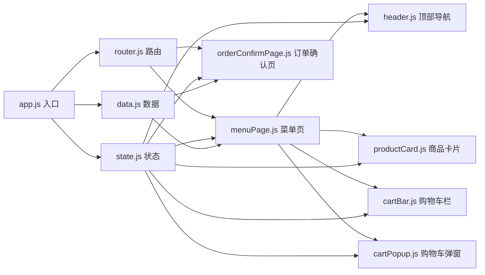
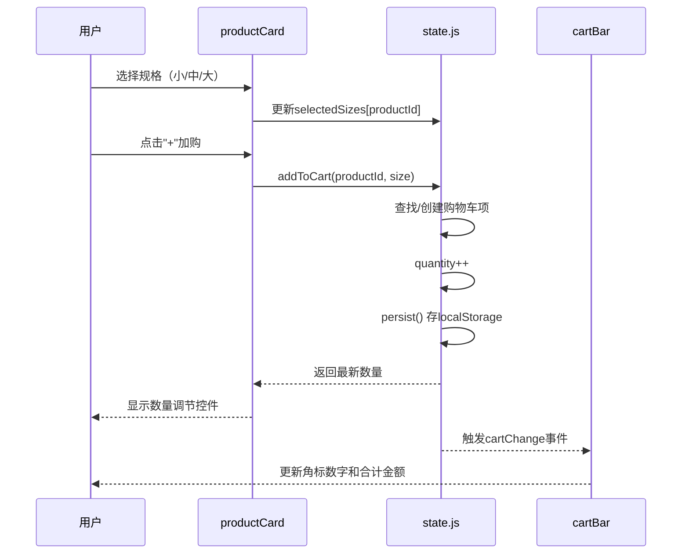
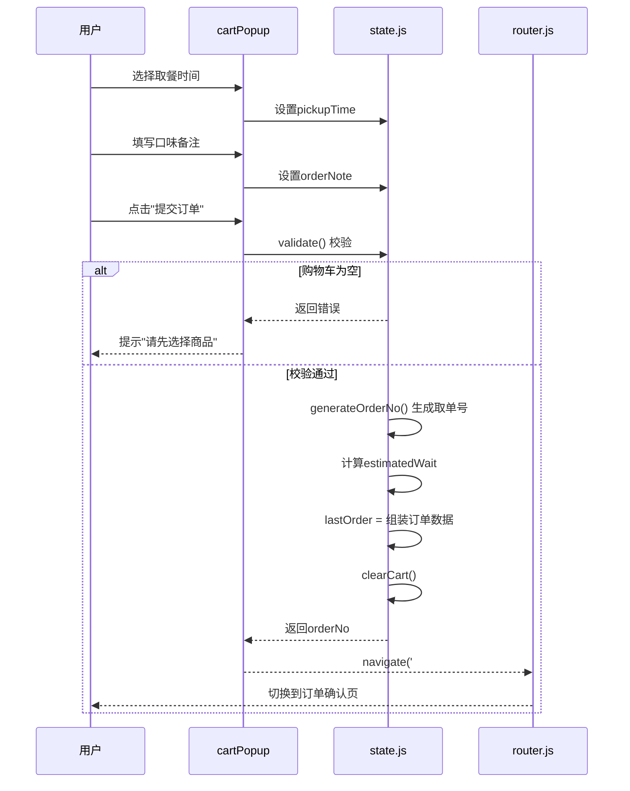

# 社区咖啡店扫码点单H5 - 技术架构文档

## 1. 技术选型

### 1.1 技术栈选择

| 层级 | 技术方案 | 选型理由 |
|------|----------|----------|
| 前端框架 | 原生 HTML5 + CSS3 + Vanilla JS | H5轻量级应用，无需复杂框架，加载速度快，兼容性好 |
| 样式方案 | CSS Variables + Flexbox + Grid | 现代CSS特性，无需预处理器，主题切换便捷 |
| 状态管理 | 原生JS模块 + localStorage | 轻量级状态，购物车本地持久化 |
| 图标方案 | SVG内联图标 | 无需额外依赖，支持自定义颜色和尺寸 |
| 图片资源 | text_to_image API生成商品图 | 高质量商品图片，符合咖啡店调性 |

### 1.2 架构模式
- **单页应用（SPA）**：通过Hash路由实现页面切换
- **模块化JS**：按功能拆分为独立模块（数据层、视图层、控制层）
- **CSS命名规范**：BEM（Block Element Modifier）

---

## 2. 目录结构设计

```
project171/
├── index.html                    # 入口HTML（包含所有页面结构）
├── css/
│   └── style.css                 # 主样式文件
├── js/
│   ├── data.js                   # 商品数据和常量定义
│   ├── state.js                  # 状态管理（购物车、当前页面等）
│   ├── router.js                 # Hash路由管理
│   ├── components/
│   │   ├── header.js             # 顶部导航组件
│   │   ├── productCard.js        # 商品卡片组件
│   │   ├── cartBar.js            # 底部购物车栏
│   │   └── cartPopup.js          # 半屏购物车弹窗
│   ├── pages/
│   │   ├── menuPage.js           # 菜单页逻辑
│   │   └── orderConfirmPage.js   # 订单确认页逻辑
│   └── app.js                    # 应用入口，初始化各模块
├── assets/
│   └── (商品图片资源)
└── .trae/documents/
    ├── PRD.md                    # 产品需求文档
    └── ARCHITECTURE.md           # 技术架构文档（本文件）
```

---

## 3. 模块设计

### 3.1 模块依赖关系图



### 3.2 核心模块说明

#### 3.2.1 data.js - 数据层
- 定义商品列表数据（咖啡/茶饮/甜点各3-4款）
- 定义规格映射（小/中/大杯对应英文标识和加价）
- 定义取餐时间选项
- 提供商品查询工具函数

#### 3.2.2 state.js - 状态管理层
- **核心状态**：
  - `currentCategory`: 当前选中品类
  - `cart`: 购物车项数组
  - `currentPage`: 当前页面
  - `selectedSizes`: 各商品当前选中规格
  - `pickupTime`: 取餐时间选择
  - `orderNote`: 口味备注
  - `lastOrder`: 最近一次订单数据
- **核心方法**：
  - `addToCart(productId, size)`: 添加到购物车
  - `updateQuantity(cartId, delta)`: 更新数量
  - `removeFromCart(cartId)`: 删除购物车项
  - `clearCart()`: 清空购物车
  - `getCartTotal()`: 计算购物车总价
  - `getCartCount()`: 计算购物车商品总数
  - `submitOrder()`: 提交订单并生成取单号
  - `persist()` / `restore()`: localStorage持久化

#### 3.2.3 router.js - 路由层
- 基于Hash的简易路由（`#/menu`, `#/order/:orderId`）
- 页面切换时的显示/隐藏逻辑
- URL参数解析（桌号：`?table=A5`）

#### 3.2.4 组件层
- **header.js**：渲染店名 + 分类Tab，处理品类切换
- **productCard.js**：渲染单个商品卡片，规格选择，加购逻辑
- **cartBar.js**：渲染底部购物车栏，角标显示，点击唤起弹窗
- **cartPopup.js**：渲染半屏购物车弹窗，数量调整，取餐时间，备注输入，提交订单

#### 3.2.5 页面层
- **menuPage.js**：组合header + 商品列表 + cartBar + cartPopup
- **orderConfirmPage.js**：渲染订单确认页完整内容

---

## 4. 核心流程时序

### 4.1 加购流程



### 4.2 提交订单流程



---

## 5. CSS架构

### 5.1 CSS变量定义（主题系统）

```css
:root {
  /* 颜色 */
  --bg-page: #FAF6F0;
  --bg-card: #FFFFFF;
  --text-primary: #3E2723;
  --text-secondary: #6D4C41;
  --text-muted: #8D6E63;
  --btn-primary: #C68B59;
  --btn-primary-hover: #B07A4A;
  --tab-active: #5D4037;
  --border: #EFE5D8;
  --accent: #C68B59;
  
  /* 尺寸 */
  --radius-card: 12px;
  --radius-btn: 20px;
  --radius-sm: 8px;
  --shadow-card: 0 2px 12px rgba(62, 39, 35, 0.08);
  --shadow-btn: 0 4px 12px rgba(198, 139, 89, 0.3);
  
  /* 间距 */
  --space-xs: 4px;
  --space-sm: 8px;
  --space-md: 16px;
  --space-lg: 24px;
  --space-xl: 32px;
}
```

### 5.2 页面布局策略
- **移动端优先**：`max-width: 430px` 居中显示，两侧留白
- **固定定位**：顶部header（60px）+ 底部cartBar（72px）固定
- **内容区域**：`padding-top: 60px; padding-bottom: 88px;`
- **半屏弹窗**：`position: fixed; bottom: 0; height: 60vh;`

---

## 6. 关键技术方案

### 6.1 规格选择 + 加购联动
- 每个商品卡片维护独立的规格选中态
- 不同规格视为不同的购物车SKU（cartItem唯一键为productId+size）
- 规格切换时实时更新显示价格

### 6.2 购物车角标飞入动画
- 使用CSS `@keyframes` 定义抛物线轨迹
- 点击加购时动态创建动画元素
- 动画结束后移除DOM元素

### 6.3 半屏购物车交互
- 遮罩层：`rgba(62, 39, 35, 0.4)` + 点击关闭
- 弹窗：`transform: translateY(100%)` → `translateY(0)` 滑入动画
- 内容可滚动：`overflow-y: auto`

### 6.4 本地持久化
- 使用 `localStorage.setItem('coffee_cart', JSON.stringify(cart))`
- 页面加载时 `restore()` 恢复购物车状态
- 桌号信息从URL `?table=xx` 解析后存入state

### 6.5 取单号生成规则
- 格式：`字母前缀 + 3位数字`（如A008）
- 前缀按当天订单量循环（A-Z）
- 数字每日重置，localStorage记录日期和序号

---

## 7. 兼容性与适配

### 7.1 视口设置
```html
<meta name="viewport" content="width=device-width, initial-scale=1.0, maximum-scale=1.0, user-scalable=no, viewport-fit=cover">
```

### 7.2 安全区域适配
- iPhone刘海屏：`env(safe-area-inset-top/bottom)`
- 顶部header和底部cartBar增加安全区域padding

### 7.3 降级方案
- 不支持CSS Grid的浏览器降级为Flexbox布局
- localStorage不可用时使用内存存储（刷新丢失但不崩溃）
- SVG图标提供PNG fallback（可选）
