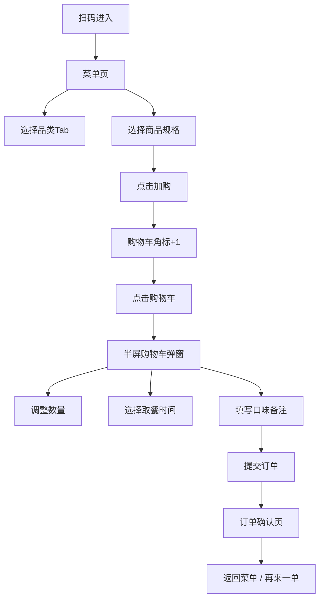

# 社区咖啡店扫码点单H5 - 产品需求文档 (PRD)

## 1. 项目概述

### 1.1 项目背景
为社区咖啡店打造一款轻量级扫码点单H5应用，顾客通过扫描桌角二维码即可自助点单，提升门店运营效率，减少排队等待时间。

### 1.2 目标用户
- 到店消费的顾客
- 咖啡店店员（用于确认订单）

### 1.3 核心价值
- 扫码即点，无需下载APP
- 清晰的菜单展示，提升点单效率
- 灵活的规格选择和口味定制
- 快速确认订单，减少沟通成本

---

## 2. 功能需求

### 2.1 页面结构

| 页面 | 功能描述 |
|------|----------|
| 菜单页 | 按品类展示商品，支持加购 |
| 购物车页/弹窗 | 调整数量、选择取餐时间、填写口味备注 |
| 订单确认页 | 展示取单号、预计等待时间、订单明细 |

### 2.2 菜单页详细需求

#### 2.2.1 顶部导航栏（固定）
- 左侧：咖啡店Logo + 店名"暖巷咖啡"
- 中间：品类Tab（咖啡 / 茶饮 / 甜点）
- 点击Tab切换对应品类商品列表

#### 2.2.2 商品卡片
每个商品卡片包含：
- 商品图片（圆角矩形）
- 商品名称
- 规格选项（小杯 / 中杯 / 大杯），默认选中中杯
- 商品价格（根据选中规格动态变化）
- 加购按钮（"+"图标）
- 已加购商品显示数量调节（- / 数量 / +）

#### 2.2.3 底部购物车栏（固定）
- 左侧：购物车图标 + 商品数量角标
- 中间：合计金额
- 右侧："去结算"按钮（点击弹出半屏购物车）

### 2.3 购物车弹窗/页面详细需求

#### 2.3.1 半屏购物车弹窗
- 从底部滑出，占屏幕高度60%
- 顶部：购物车标题 + 清空按钮
- 商品列表：
  - 商品缩略图、名称、规格
  - 单价
  - 数量调节（- / 数量 / +）
  - 删除按钮
- 底部：
  - 取餐时间选择（立即取 / 15分钟后 / 30分钟后 / 自定义）
  - 口味备注输入框
  - 合计金额
  - "提交订单"按钮

### 2.4 订单确认页详细需求

#### 2.4.1 订单信息区
- 大号取单号（如"A008"）
- 取餐二维码占位
- 预计等待时间（如"约8-12分钟"）
- 取餐时间
- 桌号信息（从扫码URL参数获取）

#### 2.4.2 订单明细区
- 商品列表（名称、规格、数量、单价、小计）
- 商品合计
- 订单总额

#### 2.4.3 操作区
- "返回菜单"按钮
- "再来一单"按钮

---

## 3. UI设计规范

### 3.1 配色方案

| 用途 | 颜色值 | 说明 |
|------|--------|------|
| 页面背景 | #FAF6F0 | 米白色 |
| 卡片背景 | #FFFFFF | 纯白色 |
| 主文字 | #3E2723 | 深棕色 |
| 次要文字 | #6D4C41 | 浅棕色 |
| 主按钮 | #C68B59 | 焦糖色 |
| 主按钮悬停 | #B07A4A | 深焦糖色 |
| 分类选中态 | #5D4037 | 深棕高亮 |
| 边框/分割线 | #EFE5D8 | 浅米色 |
| 角标/提示 | #C68B59 | 焦糖色 |
| 加购按钮 | #C68B59 | 焦糖色 |

### 3.2 字体规范
- 标题字体：Noto Serif SC / 思源宋体（展现咖啡店文艺氛围）
- 正文字体：Noto Sans SC / 思源黑体（保证可读性）
- 数字/价格：等宽数字样式

### 3.3 组件样式
- 圆角：12px（卡片）、20px（按钮）、8px（小元素）
- 阴影：柔和投影（0 2px 12px rgba(62, 39, 35, 0.08)）
- 间距：基于8px栅格系统

### 3.4 动效规范
- 页面切换：淡入淡出 + 轻微位移
- 加购动画：飞入购物车效果
- 弹窗：底部滑入 + 背景遮罩淡入
- 按钮点击：缩放反馈（0.98x）

---

## 4. 交互流程



---

## 5. 数据结构设计

### 5.1 商品数据
```javascript
{
  id: string,
  name: string,
  category: 'coffee' | 'tea' | 'dessert',
  image: string,
  prices: { small: number, medium: number, large: number },
  description: string
}
```

### 5.2 购物车项
```javascript
{
  productId: string,
  name: string,
  image: string,
  size: 'small' | 'medium' | 'large',
  sizeLabel: string,
  price: number,
  quantity: number,
  note: string
}
```

### 5.3 订单数据
```javascript
{
  orderNo: string,
  tableNo: string,
  items: CartItem[],
  pickupTime: string,
  totalAmount: number,
  estimatedWait: string,
  createdAt: Date
}
```

---

## 6. 非功能需求

### 6.1 性能要求
- 首屏加载时间 < 2s
- 页面切换动画流畅（60fps）
- 支持离线缓存基础资源

### 6.2 兼容性要求
- 微信内置浏览器
- iOS Safari 12+
- Android Chrome 70+
- 屏幕宽度适配：320px - 430px

### 6.3 体验要求
- 所有操作均有视觉反馈
- 关键操作防重复提交
- 购物车数据本地持久化
- 无网络时给出友好提示
